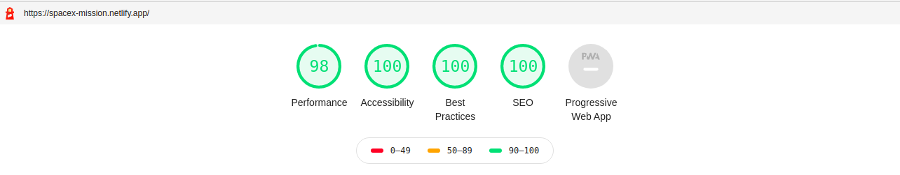
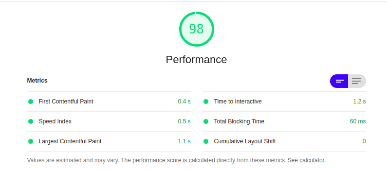
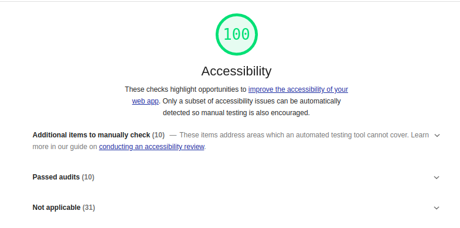
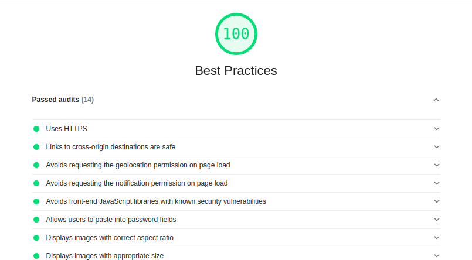
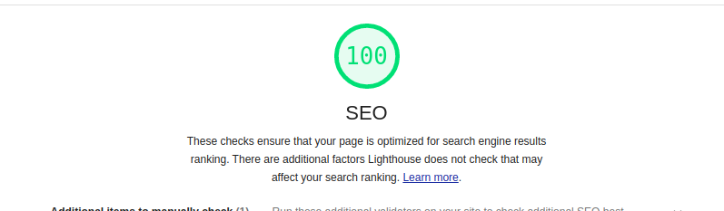

# Spacex-Launch

React Application to list and browse all the launches by spaceX.
User can also filter the results based on Launch Year, Successful Launch or Success Landing.

## Installation

To install, simply clone this repository & run the `npm install`, using cmd or teminal this will install all the dependencies related to Project

## Running Project

To run this project locally, run the following command `npm start`, this will start a local instance of the application & open your browser and copy paste url http://localhost:3000/ to open app in your browser.

## Deployment

App is deployed using **Netlify** [https://spacex-mission.netlify.app/](https://spacex-mission.netlify.app/)

## Approach

1. Fetched data using [https://api.spacexdata.com/v3](https://api.spacexdata.com/v3) API
2. Created components like:
   1. LauncList to render list of mission. 2. MissionCard to display individual spacex mission.
   2. Filter Component to filter mission by year, successfull landing or successful launch.
3. Added Prop-types check in components.
4. Add responsive design
5. Netlify Depolyment

## Library Used

- Axios
- React
- React-Testing-Library
- React-Loader-Spinner
- PropTypes

## Lighthouse Score

<h2 align="center"> Overall Score </h2>

<h2 align="center"> Performance </h2>

<h2 align="center"> Accessibility </h2>

<h2 align="center"> Best Practice </h2>

<h2 align="center"> SEO </h2>

